# EthosAI Review Portal - Architecture Diagrams

## Table of Contents
1. [High-Level Architecture](#high-level-architecture)
2. [AWS Amplify Deployment Architecture](#aws-amplify-deployment-architecture)
3. [Amazon EKS Deployment Architecture](#amazon-eks-deployment-architecture)
4. [Authentication Flow](#authentication-flow)
5. [Data Flow](#data-flow)
6. [Component Architecture](#component-architecture)

---

## High-Level Architecture

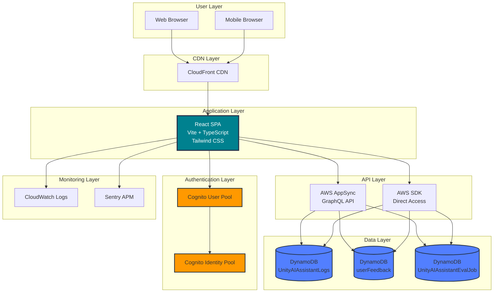

---

## AWS Amplify Deployment Architecture

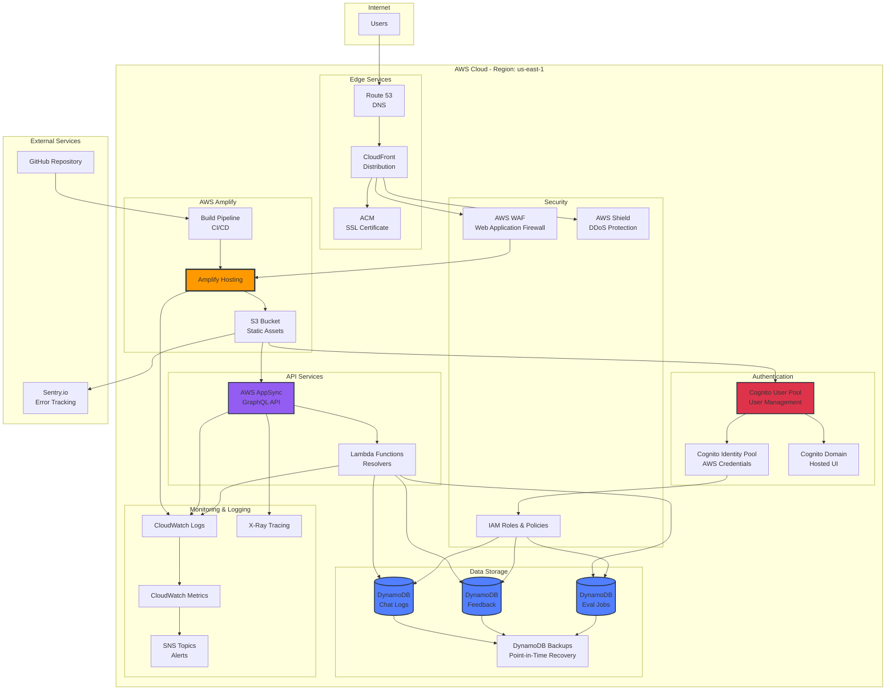

---

## Amazon EKS Deployment Architecture

```mermaid
graph TB
    subgraph "Internet"
        USER[Users]
    end

    subgraph "AWS Cloud - Region: us-east-1"
        subgraph "Edge Services"
            R53[Route 53<br/>DNS]
            ACM[ACM<br/>SSL Certificate]
        end

        subgraph "VPC - 10.0.0.0/16"
            subgraph "Public Subnets"
                ALB[Application Load Balancer<br/>AWS ALB Ingress Controller]
                NAT1[NAT Gateway<br/>AZ-1]
                NAT2[NAT Gateway<br/>AZ-2]
            end

            subgraph "Private Subnets - AZ-1"
                subgraph "EKS Cluster"
                    subgraph "Control Plane"
                        MASTER[EKS Master Nodes<br/>Managed by AWS]
                    end
                    
                    subgraph "Worker Nodes - AZ-1"
                        NODE1[EC2 t3.medium<br/>Worker Node 1]
                        POD1A[Pod: Nginx + React SPA]
                        POD1B[Pod: Nginx + React SPA]
                        NODE1 --> POD1A
                        NODE1 --> POD1B
                    end
                end
            end

            subgraph "Private Subnets - AZ-2"
                subgraph "Worker Nodes - AZ-2"
                    NODE2[EC2 t3.medium<br/>Worker Node 2]
                    POD2A[Pod: Nginx + React SPA]
                    POD2B[Pod: Nginx + React SPA]
                    NODE2 --> POD2A
                    NODE2 --> POD2B
                end
            end

            subgraph "Private Subnets - AZ-3"
                subgraph "Worker Nodes - AZ-3"
                    NODE3[EC2 t3.medium<br/>Worker Node 3]
                    POD3A[Pod: Nginx + React SPA]
                    NODE3 --> POD3A
                end
            end
        end

        subgraph "Container Registry"
            ECR[Amazon ECR<br/>Docker Images]
        end

        subgraph "Authentication"
            CUP[Cognito User Pool]
            CIP[Cognito Identity Pool]
        end

        subgraph "Data Storage"
            DDB1[(DynamoDB<br/>Chat Logs)]
            DDB2[(DynamoDB<br/>Feedback)]
            DDB3[(DynamoDB<br/>Eval Jobs)]
        end

        subgraph "Monitoring"
            CWL[CloudWatch Logs<br/>Container Insights]
            CWM[CloudWatch Metrics]
            CWI[CloudWatch<br/>Container Insights]
            GRAF[Grafana<br/>Optional]
        end

        subgraph "Kubernetes Services"
            HPA[Horizontal Pod Autoscaler]
            CA[Cluster Autoscaler]
            METRICS[Metrics Server]
        end

        subgraph "Security"
            WAF[AWS WAF]
            SG[Security Groups]
            NACL[Network ACLs]
            IAM[IAM Roles<br/>IRSA]
        end
    end

    USER --> R53
    R53 --> ALB
    ALB --> ACM
    ALB --> WAF
    ALB --> POD1A
    ALB --> POD1B
    ALB --> POD2A
    ALB --> POD2B
    ALB --> POD3A

    ECR --> NODE1
    ECR --> NODE2
    ECR --> NODE3

    POD1A --> CUP
    POD2A --> CUP
    POD3A --> CUP
    CUP --> CIP
    CIP --> IAM

    POD1A --> DDB1
    POD1A --> DDB2
    POD1A --> DDB3
    POD2A --> DDB1
    POD3A --> DDB1

    NODE1 --> NAT1
    NODE2 --> NAT2
    NODE3 --> NAT1

    MASTER --> METRICS
    METRICS --> HPA
    HPA --> POD1A
    CA --> NODE1
    CA --> NODE2

    NODE1 --> CWL
    NODE2 --> CWL
    NODE3 --> CWL
    CWL --> CWM

    PROM --> GRAF
    NODE1 --> PROM

    ALB --> SG
    NODE1 --> SG
    SG --> NACL

    style ALB fill:#FF9900,stroke:#232F3E,stroke-width:3px
    style MASTER fill:#FF9900,stroke:#232F3E,stroke-width:3px
    style NODE1 fill:#EC7211,stroke:#232F3E,stroke-width:2px
    style NODE2 fill:#EC7211,stroke:#232F3E,stroke-width:2px
    style NODE3 fill:#EC7211,stroke:#232F3E,stroke-width:2px
    style DDB1 fill:#527FFF,stroke:#232F3E,stroke-width:2px
    style DDB2 fill:#527FFF,stroke:#232F3E,stroke-width:2px
    style DDB3 fill:#527FFF,stroke:#232F3E,stroke-width:2px
```

---

## Authentication Flow

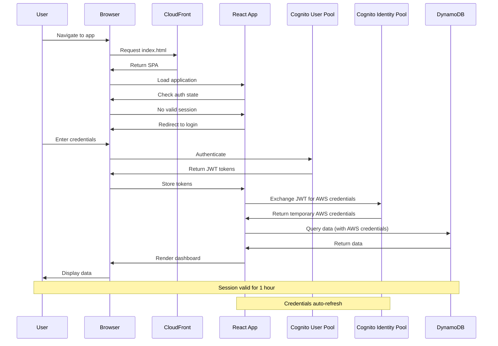

---

## Data Flow

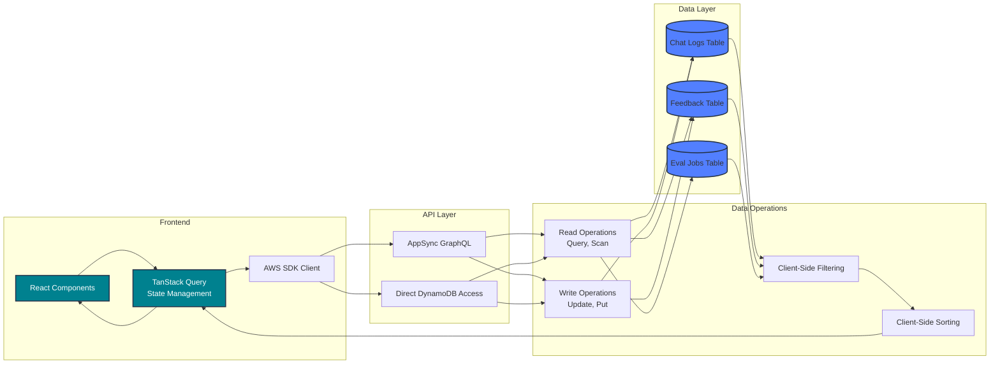

---

## Component Architecture

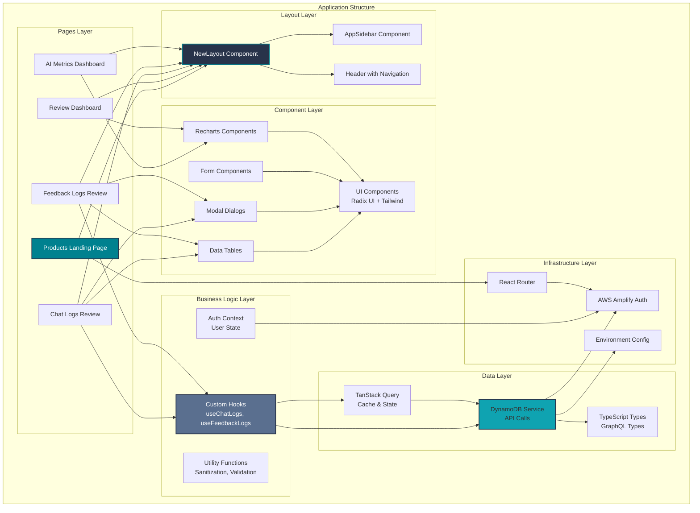

---

## Multi-Product Architecture

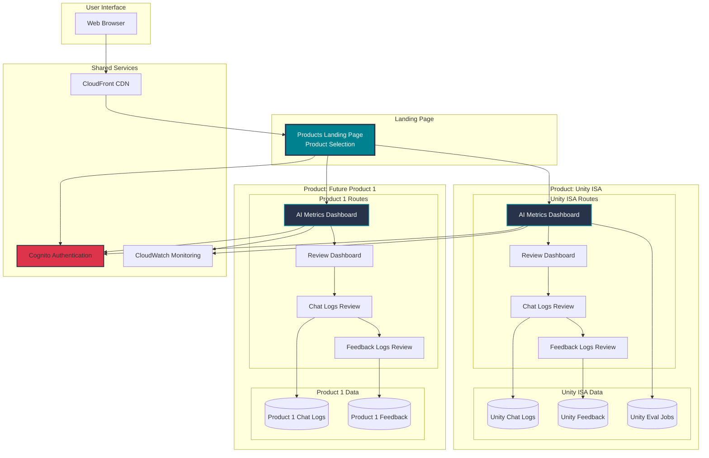

---

## Security Architecture

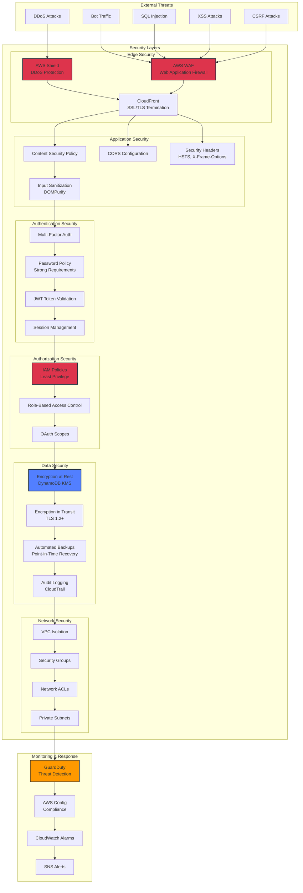

---

## Monitoring & Observability Architecture

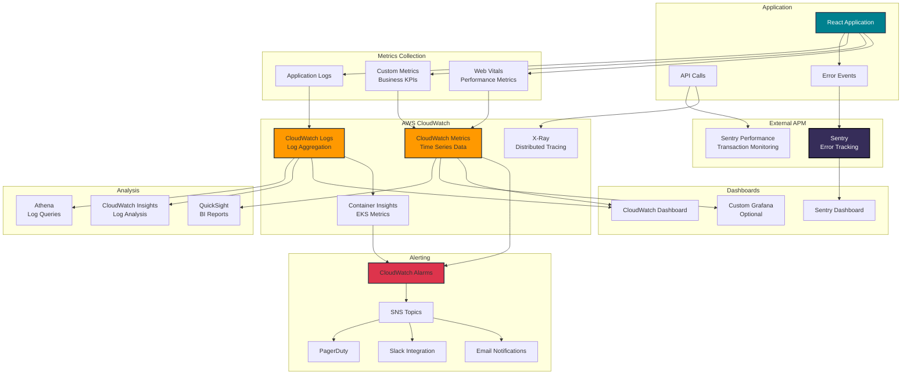

---

## CI/CD Pipeline Architecture

```mermaid
graph LR
    subgraph "Source Control"
        GIT[GitHub Repository]
        BRANCH[Feature Branch]
        MAIN[Main Branch]
    end

    subgraph "CI Pipeline"
        TRIGGER[Webhook Trigger]
        CHECKOUT[Checkout Code]
        DEPS[Install Dependencies]
        LINT[Lint & Format Check]
        TEST[Run Tests]
        BUILD[Build Application]
        SCAN[Security Scan]
    end

    subgraph "Artifact Storage"
        S3[S3 Bucket<br/>Build Artifacts]
        ECR[ECR<br/>Docker Images]
    end

    subgraph "CD Pipeline - Amplify"
        AMP_DEPLOY[Amplify Deploy]
        AMP_PREVIEW[Preview Environment]
        AMP_PROD[Production Deploy]
    end

    subgraph "CD Pipeline - EKS"
        DOCKER[Build Docker Image]
        PUSH[Push to ECR]
        KUBECTL[kubectl apply]
        ROLLOUT[Rolling Update]
    end

    subgraph "Environments"
        DEV[Development]
        STAGING[Staging]
        PROD[Production]
    end

    subgraph "Post-Deploy"
        SMOKE[Smoke Tests]
        HEALTH[Health Checks]
        NOTIFY[Notifications]
    end

    BRANCH --> GIT
    GIT --> MAIN
    MAIN --> TRIGGER
    TRIGGER --> CHECKOUT
    CHECKOUT --> DEPS
    DEPS --> LINT
    LINT --> TEST
    TEST --> BUILD
    BUILD --> SCAN

    SCAN --> S3
    SCAN --> DOCKER

    S3 --> AMP_DEPLOY
    AMP_DEPLOY --> AMP_PREVIEW
    AMP_PREVIEW --> AMP_PROD

    DOCKER --> PUSH
    PUSH --> ECR
    ECR --> KUBECTL
    KUBECTL --> ROLLOUT

    AMP_PREVIEW --> DEV
    AMP_PROD --> STAGING
    AMP_PROD --> PROD

    ROLLOUT --> DEV
    ROLLOUT --> STAGING
    ROLLOUT --> PROD

    DEV --> SMOKE
    STAGING --> SMOKE
    PROD --> SMOKE

    SMOKE --> HEALTH
    HEALTH --> NOTIFY

    style GIT fill:#181717,stroke:#fff,stroke-width:2px,color:#fff
    style BUILD fill:#00818F,stroke:#28334A,stroke-width:2px,color:#fff
    style PROD fill:#DD344C,stroke:#232F3E,stroke-width:2px,color:#fff
    style SMOKE fill:#4CAF50,stroke:#2E7D32,stroke-width:2px
```

---

## Disaster Recovery Architecture

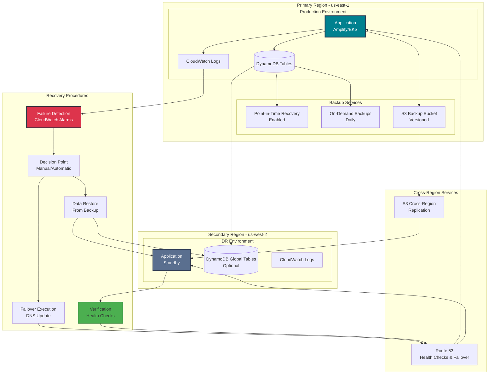

---

## Legend

### Color Coding

- **Teal (#00818F)**: Application/Frontend Components
- **Dark Blue (#28334A)**: Core Infrastructure
- **Orange (#FF9900)**: AWS Managed Services
- **Blue (#527FFF)**: Data Storage
- **Red (#DD344C)**: Security/Critical Services
- **Green (#4CAF50)**: Success/Verification States

### Icon Reference

- **Cylinder**: Database/Storage
- **Rectangle**: Service/Component
- **Diamond**: Decision Point
- **Hexagon**: External Service

---

## Diagram Usage

These diagrams can be rendered using:
- **GitHub**: Native Mermaid support in markdown
- **VS Code**: Mermaid Preview extension
- **Confluence**: Mermaid plugin
- **Draw.io**: Import Mermaid syntax
- **Online**: https://mermaid.live/

---

**Document Version**: 1.0
**Last Updated**: December 2024
**Maintained By**: Architecture Team
